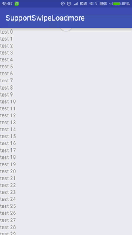

# SupportSwipeLoadmore
支持滑动加载更多

##Feature

* `完全兼容`：完全兼容原有代码，无需改动即可支持加载更多
* `开箱即用`：使用简单，一行代码搞定
* `完美体验`：体验效果优秀，最高效、可靠的实现方案
* `可自定义`：自定义加载触发条件、自定义加载提示

##Demo
初始化

    RecyclerSwipeHelper helper = new RecyclerSwipeHelper(swipeRefreshLayout, recyclerView);

监听下拉刷新

    helper.setOnRefreshListener(new SwipeRefreshLayout.OnRefreshListener() {
        @Override
        public void onRefresh() {
            // do something
        }
    });

监听上滑加载更多

    helper.setOnLoadmoreListener(new OnLoadmoreListener() {
        @Override
        public void onLoadmore() {
            // do something
        }
    });

##Picture


##How to

- Step 1. 把 JitPack repository 添加到build.gradle文件中 repositories的末尾:
```
repositories {
    maven { url "https://jitpack.io" }
}
```
- Step 2. 在你的app build.gradle 的 dependencies 中添加依赖
```
dependencies {
	compile 'com.github.alafighting:SupportSwipeLoadmore:v0.0.4'
}
```

##致谢
- Google SwipeRefreshLayout
- [dim](https://github.com/zzz40500)
- android-cjj [Android-RecyclerViewWithFooter](https://github.com/android-cjj/Android-RecyclerViewWithFooter)
- [Paginate](https://github.com/MarkoMilos/Paginate)
