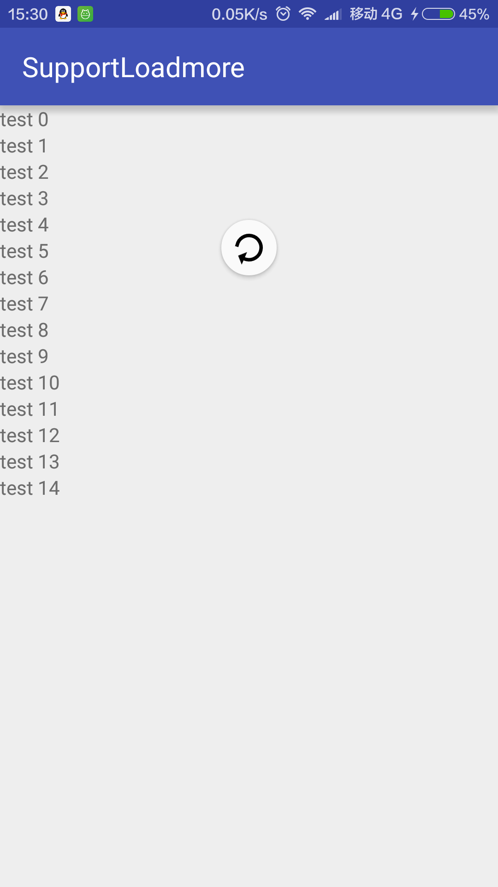
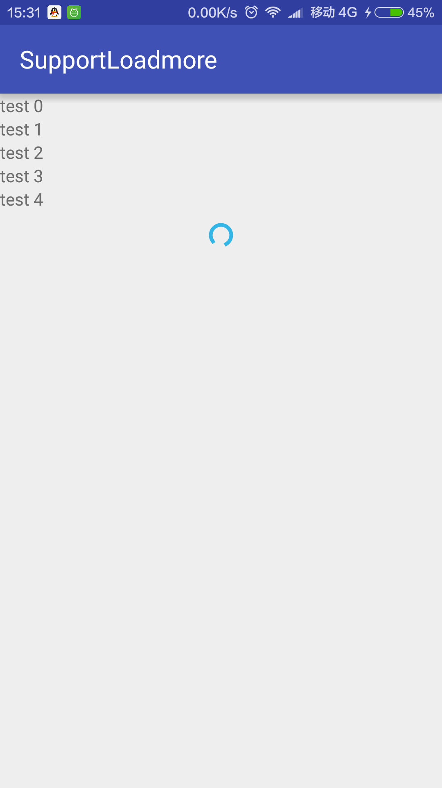

# SupportSwipeLoadmore
支持滑动加载更多

##Demo
初始化

    RecyclerSwipeHelper helper = new RecyclerSwipeHelper(swipeRefreshLayout, recyclerView);

监听下拉刷新

    helper.addOnRefreshListener(new SwipeRefreshLayout.OnRefreshListener() {
        @Override
        public void onRefresh() {
            mHandler.postDelayed(new Runnable() {
                @Override
                public void run() {
                    adapter.clear();
                    adapter.addAll(Arrays.asList("test", "test", "test", "test", "test"));
                    helper.setRefreshing(false);
                }
            }, 1000);
        }
    });

监听上滑加载更多

    helper.addOnLoadmoreListener(new OnLoadmoreListener() {
        @Override
        public void onLoadmore() {
            mHandler.postDelayed(new Runnable() {
                @Override
                public void run() {
                    adapter.addAll(Arrays.asList("test", "test", "test", "test", "test"));
                    helper.setLoadmoreing(false);
                }
            }, 1000);
        }
    });

##Picture



##How to

- Step 1. 把 JitPack repository 添加到build.gradle文件中 repositories的末尾:
```
repositories {
    maven { url "https://jitpack.io" }
}
```
- Step 2. 在你的app build.gradle 的 dependencies 中添加依赖
```
dependencies {
	compile 'com.github.alafighting:SupportSwipeLoadmore:v0.0.1'
}
```

##致谢
- Google SwipeRefreshLayout
- [dim](https://github.com/zzz40500)
- android-cjj [Android-RecyclerViewWithFooter](https://github.com/android-cjj/Android-RecyclerViewWithFooter)
